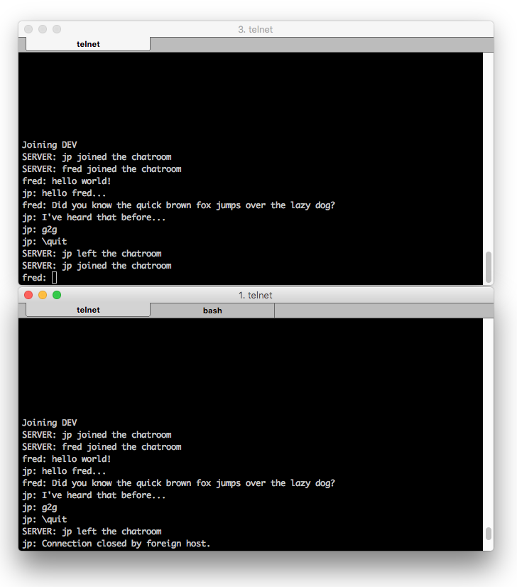

# chat

Simple example of implementing a multi-user multi-chatroom server in Java. It's utilizing only core features found in Java including:
- ExecutorService
- Observable/Observer
- Streams
- ServerSocket

This project was done over the course of two days. There's a ton of missing features. I wouldn't replace your favorite IRC with this just yet.

## Getting started

### Server

Load into your favorite IDE and run *Server* as it contains the main().

### Client

Log onto chat server and follow the on-screen instructions. It will ask you to pick a username, followed by a chatroom you're interested in joining. If there was an existing conversation, it will bring you up to speed!

    telnet localhost 9000

## Screenshot

