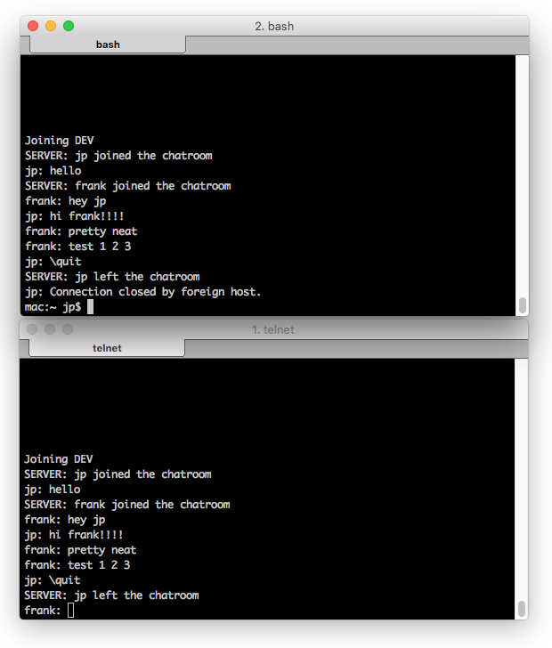

# chat

Simple example of implementing a multi-user multi-chatroom server in Java. It's utilizing only core features found in Java including:
- ExecutorService
- Observable/Observer
- Streams
- ServerSocket

This project was done over the course of two days. There's a lot of features missing for a full fledged IRC replacement, but it's half way there.

## Getting started

*Server*

Load into your favorite IDE and run *Server* as it contains the main().

*Client*

Log into the server an follow the on screen instructions. It will ask you to pick a username, followed by a chatroom you're interested in joining.

`telnet localhost 9000`

## Screenshot

